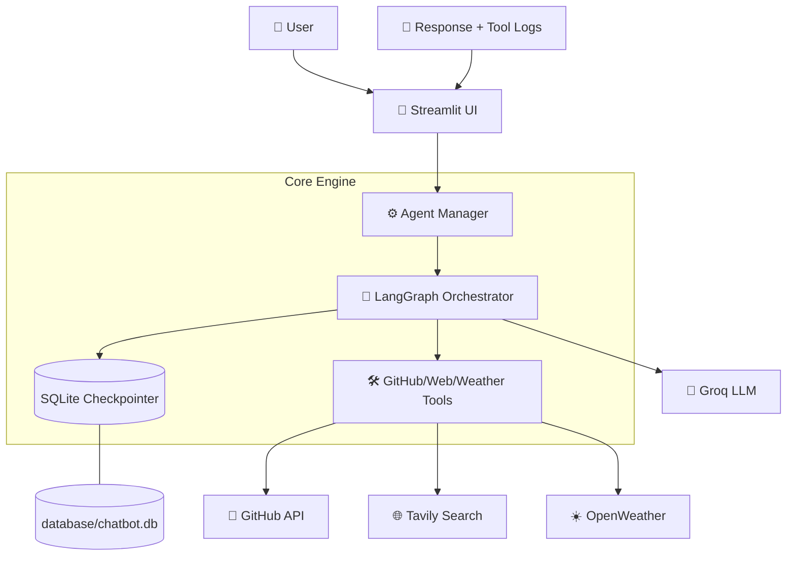

# 🤖 AI Agent - Secure GitHub Orchestrator

A production-ready LangGraph agent for autonomous GitHub management with persistent memory and HITL security.

---

## 📋 Table of Contents

- [Overview](#-overview)
- [Features](#-features)
- [Architecture](#-architecture)
- [Tech Stack](#-tech-stack)
- [Installation](#-installation)
- [Usage](#-usage)
- [Project Structure](#-project-structure)
- [Security & Privacy](#-security--privacy)

---

## 🎯 Overview

AI Agent is an enterprise-grade GitHub management assistant that bridges the gap between natural language and complex repository operations. It leverages:

- 💾 **Persistent Session Memory** via Async SQLite checkpointing.
- 🛡️ **Human-in-the-Loop (HITL)** for destructive action safety.
- 🐙 **GitHub MCP Integration** for direct repository manipulation.
- ⚡ **Async Streaming** for real-time tool-call visibility.

Built for developers and DevOps engineers who want to automate repository creation, issue tracking, and code analysis through a secure, conversational interface.

---

## 🎥 What Makes This Special?

| Feature | Description |
|---|---|
|  **Memory** | Remembers every thread across restarts using `AsyncSqliteSaver`. |
|  **Safety** | Intercepts dangerous commands (delete/update) for manual user approval. |
|  **UX** | Auto-titles conversations based on the initial user intent. |
|  **Performance** | Bridges Async/Sync barriers to work seamlessly within Streamlit. |
|  **Privacy** | Zero-Leak Security with a strict database/secret ignore policy. |

---

## ✨ Features

### 🐙 GitHub Intelligence

- **Repository Management:** Create, list, and analyze repositories.
- **Issue Tracking:** Automate issue creation and status updates.
- **Code Analysis:** Search through codebases and summarize files.

### 🌐 Extended Capabilities

- **Real-time Web Search:** Integrated Tavily search for fetching live information.
- **Weather Updates:** Live weather data retrieval via OpenWeatherMap API.

### 🛡️ Security & Control

- **HITL Verification:** Critical actions pause for user "Approve/Reject" clicks.
- **Stateful Recovery:** Never lose an agent's progress mid-task.
- **Isolated Database:** Dedicated SQLite storage per thread.

### 💬 Advanced UX

- **Tool-Call Visibility:** Beautiful light-blue UI indicators for active tool usage.
- **Sidebar History:** Easily switch between past conversations with auto-generated titles.
- **Streaming Responses:** Real-time token generation for a snappy feel.

---

## 🏗️ Architecture



**Core Components:**

- **Agent Manager:** Orchestrates LangGraph nodes and tool bindings.
- **Async SQLite Saver:** Handles long-term persistence of chat states.
- **Chat Interface:** Manages the complex async event loop required by Streamlit.
- **Tool Suite:** Dedicated modules for GitHub operations, Web Search, and Weather.

---

## 🛠️ Tech Stack

| Component | Technology |
|---|---|
| Language | Python 3.10+ |
| Package Manager | uv (Ultra-fast) |
| Orchestration | LangGraph |
| LLM Provider | Groq (Llama models) |
| Database | Async SQLite |
| UI Framework | Streamlit |
| Tool Protocol | Model Context Protocol (MCP) |

---

## 📦 Installation

### Prerequisites

- Python 3.10 or higher
- `uv` package manager (`pip install uv`)
- API Keys: GitHub Token, Groq API, Tavily API, OpenWeatherMap API

### Step 1: Clone the Repository

Clone this repository to your local machine and navigate into the project directory.

### Step 2: Virtual Environment & Dependencies

Using `uv` for 10x faster installation:

```bash
# Create venv and initialize
uv venv
uv init

# Activate environment
source .venv/bin/activate  # Windows: .venv\Scripts\activate

# Install and add dependencies
uv pip install -r requirements.txt
uv add -r requirements.txt
```

### Step 3: Set Up Environment Variables

```bash
cp .env.example .env
```

Edit `.env`:

```env
GITHUB_TOKEN=your_github_token
GROQ_API_KEY=your_groq_api_key
TAVILY_API_KEY=your_tavily_key
OPENWEATHER_API_KEY=your_weather_key
```

---

## 🚀 Usage

### Starting the Agent

```bash
streamlit run app.py
```

### Interaction Flow

1. **New Chat:** Click "➕ New Chat" in the sidebar to start a fresh thread.
2. **Web Search:** Ask *"What is the latest news on AI agents?"*
3. **GitHub Actions:** Ask *"Create a new repository named 'test-repo'."*
4. **Approval:** For destructive actions, watch for the Red Security Alert. Click **Approve** to proceed.

---

## 📁 Project Structure

```
ai-agent/
│
├── .gitignore
├── .env.example
├── app.py                  # Main Entry Point & UI Sidebar
├── main.py                 # Core execution entry
├── requirements.txt        # Dependencies
├── .env                    # Secrets (Excluded from Git)
├── README.md               # This documentation
│
├── config/                 # Configuration Management
│   ├── __init__.py
│   └── settings.py         # Pydantic-based settings
│
├── core/                   # Logic Layer
│   ├── __init__.py
│   ├── agent_manager.py    # LangGraph & Node Logic
│   ├── database_manager.py # DB initialization & maintenance
│   └── server_manager.py   # MCP Server orchestration
│
├── database/               # Storage Layer (Auto-created if missing)
│   └── .gitkeep            # Ensures folder persists on GitHub
│
├── client/                 # Client Implementations
│   ├── __init__.py
│   ├── client_manager.py
│   └── github_manager.py
│
├── server/                 # MCP Servers
│   ├── __init__.py
│   ├── chatbot_server.py
│   └── github_mcp_server.py
│
├── tools/                  # Extensible Toolset
│   ├── __init__.py
│   ├── create_repository.py
│   ├── delete_repository.py
│   ├── list_repositories.py
│   ├── search_tool.py      # Tavily Search Integration
│   └── weather.py          # OpenWeatherMap Integration
│
└── extra/                  # Helper functions
```

---

## 🔒 Security & Privacy

AI Agent is designed with a **"Local-First"** data philosophy:

- **No Data Leaks:** The `.gitignore` is pre-configured to block `*.db`, `*.db-wal`, and `*.db-shm`. Your chat history stays on your machine.
- **Secret Protection:** `.env` and `secrets.toml` are strictly ignored.
- **Folder Integrity:** Uses the `.gitkeep` pattern to ensure your deployment structure is correct without exposing your private database.
- **HITL:** No destructive tool can execute without an explicit `Command(resume="APPROVE")` signal from the UI.

---

## ✅ Roadmap Progress

- [x] LangGraph State Persistence
- [x] Groq LLM Integration
- [x] Tavily Web Search Tool
- [x] OpenWeather Integration
- [x] GitHub MCP Tool Suite
- [x] Human-in-the-Loop Security
- [x] uv Package Management Support

---

*Last Updated: February 2026*
